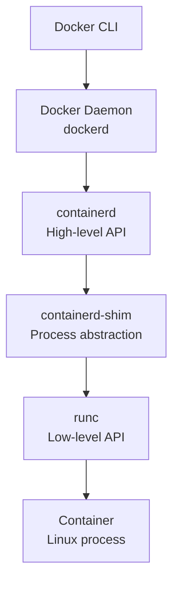

Page
1
of 16
# 
# Docker Deep Dive: From Concepts to Container Deployment
## Learning Objectives
By the end of this lecture, you will:
- Understand Docker's architecture and key components
- Learn essential Docker commands and Dockerfile syntax
- Implement multi-stage builds for optimized container images
- Successfully containerize a FastAPI application
- Apply Docker best practices for security and efficiency
---
## What is Docker? The Three Meanings
Docker can refer to three distinct but related things:
### 1. **Docker Inc.** - The Company
- Originally a San Francisco startup called `dotCloud` (Platform as a Service)
- Rebranded to Docker Inc when container technology gained popularity
- Now focuses on container development tools and enterprise solutions
### 2. **Docker Technology** - The Container Platform
- Container build, runtime, and orchestration technology
- Includes Docker Engine, containerd, and related tools
- Available in Community Edition (CE) and Enterprise Edition (EE)
### 3. **Moby Project** - The Open Source Foundation
- Open source project hosted on GitHub
- Goal: Break Docker into modular components
- Houses the Docker Engine repository and containerd project
---
## Docker Architecture Overview
Docker follows a client-server architecture:

**Key Components:**
- **Docker CLI**: Command-line interface for user interaction
- **Docker Daemon**: Server that manages containers, images, networks
- **containerd**: High-level container runtime (manages container lifecycle)
- **containerd-shim**: Process abstraction layer that manages individual containers
- Shims help abstract low-level runtimes
- Shim lives as long as a container process
- Intercepts container's stdin, stdout, and stderr streams and redirects to logs
- Allows containerd to restart without affecting running containers
- **runc**: Low-level container runtime (creates and runs containers)
- **Container**: Regular Linux process running in isolated namespaces
---
## Essential Docker Commands
### Image Management Commands
#### `docker pull` - Download Images
```bash
# pull specific version
docker pull python:3.12-slim
# pull latest (default)
docker pull nginx
# pull from specific registry
docker pull ghcr.io/username/repo:tag
```
#### `docker images` - List Local Images
```bash
docker images
# output shows:
# REPOSITORY TAG IMAGE ID CREATED SIZE
# python 3.12-slim abc123... 2 days ago 150MB
# nginx latest def456... 1 week ago 187MB
```
#### `docker build` - Create Images
```bash
# basic build
docker build -t task-manager:v1.0 .
# build with specific dockerfile
docker build -f Dockerfile.prod -t task-manager:prod .
# multi-stage build targeting specific stage
docker build --target builder -t task-manager:builder .
```
#### `docker ps` - List Running Containers
```bash
# list RUNNING container
docker ps
# list containers in all states
docker ps -a
```
### Container Management Commands
#### `docker run` - Create and Start Containers
```bash
# basic run
docker run --rm nginx:bookworm-perl
# interactive mode with shell
docker run --rm -it python:3.12-slim bash
# port mapping and detached mode
docker run -d -p 8000:8000 --name cool-server-name nginx:bookworm-perl
# TODO: turn into nginx:bookwork-perl
# environment variables and volume mounting
docker run -e PYTHONUNBUFFERED=1 \
-v $(pwd)/data:/app/data \
task-manager:v1.0
```
**Common Flags:**
- `--rm`: Automatically remove container when it exits
- `-it`: Interactive terminal
- `-d`: Run in detached (background) mode
- `-p HOST_PORT:CONTAINER_PORT`: Port mapping
- `--name`: Assign container name
- `-e`: Set environment variables
- `-v`: Mount volumes
#### `docker exec` - Execute Commands in Running Containers
```bash
# open bash shell in running container
docker exec -it container_name bash
# run single command
docker exec container_name ls -la /app
```
### Image Tagging and Naming
Images follow the format: `[REGISTRY/]NAMESPACE/REPOSITORY[:TAG]`
**Examples:**
- `python:3.12-slim` (Docker Hub, official image)
- `mycompany/webapp:v2.1.0` (Docker Hub, user namespace)
- `ghcr.io/username/project:main` (GitHub Container Registry)
**Common Tagging Strategies:**
- Semantic versioning: `v1.2.1`, `v2.0.0`
- Git SHA: `abc123f`, `latest-dev`
- Environment: `prod`, `staging`, `dev`
- Cool Name: `mariobros-v1`
---
## Working with Running Containers
### Volume Mounts and File Access
Docker provides several ways to share files between your host system and
containers:
#### Bind Mounts
```bash
# create a file in the current working directory
cat << EOF > hello.py
#!/usr/bin/env python3
import os
import sys
from datetime import datetime
def main():
print("Hello from Docker!")
print(f"Current time: {datetime.now()}")
print(f"Python version: {sys.version}")
print(f"Current directory: {os.getcwd()}")
print(f"Files in current directory:")
for item in os.listdir('.'):
print(f" - {item}")
if __name__ == "__main__":
main()
EOF
# mount current directory to /app in container
docker run --rm -v $(pwd):/app -w /app python:3.12-slim python hello.py
# read-only mount
docker run --rm -v $(pwd):/app:ro -w /app python:3.12-slim python hello.py
```
#### Named Volumes
```bash
# create a named volume
docker volume create task-data
# use named volume
docker run -v task-data:/app/data task-manager:latest
# list volumes
docker volume ls
# inspect volume details
docker volume inspect task-data
```
#### Temporary Mounts (tmpfs)
```bash
# mount temporary filesystem in memory
docker run --tmpfs /tmp task-manager:latest
# useful for temporary files that don't need persistence
```
**@note:** bind mounts are great for development as they reflect live changes, NOT
TO BE USED IN PRODUCTION
### Connecting to Running Containers
#### Using `docker exec`
```bash
# @note: you need a running container
docker run --rm -it --name connecttome -p 8000:80 nginx:1.29.0-bookworm
# get interactive bash shell in running container in another shell session
docker exec -it connecttome bash
# run single command and see output
docker exec connecttome ls -la /
# set environment variables for the exec session
docker exec -e DEBUG=1 -it connecttome bash
```
#### Using `docker attach`
```bash
# @note: you need a running container
docker run --rm -it --name attachtome -p 8000:80 nginx:1.29.0-bookworm
# attach to container's main process (STDOUT/STDERR)
docker attach attachtome
# detach without stopping container: Ctrl+P, Ctrl+Q
# @note: if you exit while attached, it may stop the container
```
**Key Differences:**
- `exec`: creates new process inside container, safer for interaction
- `attach`: connects to the main container process, useful if you are using a
debugger
#### Practical Examples
**debugging running containers:**
```bash
# check container processes
docker exec task-api ps aux
# examine log files
docker exec task-api cat /var/log/app.log
# check network connectivity
docker exec task-api curl http://localhost:8000/health
# install debugging tools temporarily
docker exec --user root task-api apt-get update
docker exec --user root task-api apt-get install -y curl
```
**@note:** changes made with exec (like installing packages) are lost when the
container is removed unless you commit them to a new image
---
## Dockerfile Deep Dive
A Dockerfile is a text file containing instructions to build a Docker image. Each
instruction creates a new layer in the image.
**Think of a Dockerfile like a recipe for baking a cake:**
- The recipe lists ingredients and step-by-step instructions
- Each step builds upon the previous one (mix flour, add eggs, bake, etc.)
- If you mess up one step, you might need to start over from that point
- The final result is a complete cake that anyone can recreate using the same
recipe
Similarly, a Dockerfile:
- Lists base images and step-by-step build instructions
- Each instruction creates a new layer that builds on previous layers
- If one instruction fails, Docker can restart from that layer (caching)
- The final result is a complete container image that runs consistently anywhere
### Core Instructions
#### `FROM` - Base Image
Every Dockerfile starts with `FROM`:
```dockerfile
# use official Python runtime as base
FROM python:3.12-slim
# multi-stage build example
FROM python:3.12-slim AS builder
FROM python:3.12-slim AS final
```
In your assignment, you'll use `python:3.12-slim` as the base image for both
stages. The `slim` variant is smaller than the full Python image, containing only
essential packages.
#### `WORKDIR` - Working Directory
Set the working directory for subsequent instructions:
```dockerfile
WORKDIR /app
# creates directory if it doesn't exist
# all relative paths now relative to /app
```
Your assignment requires setting the working directory to `/app` in both stages.
#### `ENV` - Environment Variables
```dockerfile
# set environment variables
ENV VIRTUAL_ENV=/app/.venv
ENV PATH="/app/.venv/bin:${PATH}"
ENV PYTHONDONTWRITEBYTECODE=1 PYTHONUNBUFFERED=1
# multiple variables in single line
ENV PYTHONDONTWRITEBYTECODE=1 PYTHONUNBUFFERED=1
```
For your assignment:
- `VIRTUAL_ENV`: tells Python where the virtual environment is located
- `PATH`: prepends the venv bin directory so Python finds packages there first
- `PYTHONDONTWRITEBYTECODE=1`: prevents Python from creating .pyc files (cleaner
containers)
- `PYTHONUNBUFFERED=1`: prevents Python from buffering stdout/stderr (immediate log
output)
#### `RUN` - Execute Commands
```dockerfile- If you mess up one step, you might need to start over from that point
- The final result is a complete cake that anyone can recreate using the same
recipe
Similarly, a Dockerfile:
- Lists base images and step-by-step build instructions
- Each instruction creates a new layer that builds on previous layers
- If one instruction fails, Docker can restart from that layer (caching)
- The final result is a complete container image that runs consistently anywhere
### Core Instructions
#### `FROM` - Base Image
Every Dockerfile starts with `FROM`:
```dockerfile
# use official Python runtime as base
FROM python:3.12-slim
# multi-stage build example
FROM python:3.12-slim AS builder
FROM python:3.12-slim AS final
```
In your assignment, you'll use `python:3.12-slim` as the base image for both
stages. The `slim` variant is smaller than the full Python image, containing only
essential packages.
#### `WORKDIR` - Working Directory
Set the working directory for subsequent instructions:
```dockerfile
WORKDIR /app
# creates directory if it doesn't exist
# all relative paths now relative to /app
```
Your assignment requires setting the working directory to `/app` in both stages.
#### `ENV` - Environment Variables
```dockerfile
# set environment variables
ENV VIRTUAL_ENV=/app/.venv
ENV PATH="/app/.venv/bin:${PATH}"
ENV PYTHONDONTWRITEBYTECODE=1 PYTHONUNBUFFERED=1
# multiple variables in single line
ENV PYTHONDONTWRITEBYTECODE=1 PYTHONUNBUFFERED=1
```
For your assignment:
- `VIRTUAL_ENV`: tells Python where the virtual environment is located
- `PATH`: prepends the venv bin directory so Python finds packages there first
- `PYTHONDONTWRITEBYTECODE=1`: prevents Python from creating .pyc files (cleaner
containers)
- `PYTHONUNBUFFERED=1`: prevents Python from buffering stdout/stderr (immediate log
output)
#### `RUN` - Execute Commands
```dockerfile
# install uv package manager
COPY --from=ghcr.io/astral-sh/uv:latest /uv /uvx /bin/
# install dependencies with uv
RUN uv sync --no-install-project --no-editable
# sync the complete project
RUN uv sync --no-editable
# traditional approach (not used in your assignment)
RUN pip install --upgrade pip && pip install -r requirements.txt
```
Your assignment uses `uv`, a modern Python package installer that's significantly
faster than pip. The flags used:
- `--no-install-project`: install dependencies but not the project itself (build
stage)
- `--no-editable`: install packages normally, not in development mode
#### `COPY` - File Operations
```dockerfile
# copy from external image (uv installer)
COPY --from=ghcr.io/astral-sh/uv:latest /uv /uvx /bin/
# copy dependency specification
COPY pyproject.toml ./
# copy application code with rename
COPY . /cc_simple_server ./
# multi-stage: copy from previous stage with ownership
COPY --from=builder --chown=app:app /app/.venv /app/.venv
```
Key patterns in your assignment:
- `--from=external-image`: copy files from any Docker image, not just previous
stages
- `--chown=app:app`: set file ownership during copy (security best practice)
- Path renaming: `COPY source destination` can rename directories during copy
#### `EXPOSE` - Document Ports
```dockerfile
# document that app listens on port 8000
EXPOSE 8000
```
**@note:** `EXPOSE` is documentation only. Use `-p` flag in `docker run` to
actually publish ports.
#### `ENTRYPOINT` vs `CMD`
```dockerfile
# CMD only: can be completely overridden
CMD ["uvicorn", "cc_simple_server.server:app", "--reload", "--host", "0.0.0.0", "--
port", "8000"]
# ENTRYPOINT only: fixed command that always runs
ENTRYPOINT ["python", "app.py"]
# combined: ENTRYPOINT + CMD
ENTRYPOINT ["python", "app.py"]
CMD ["--port", "8000"]
# results in: python app.py --port 8000
```
Your assignment uses only `CMD`, which means:
- The entire command can be overridden at runtime
- Provides flexibility for testing different configurations
- Common pattern for web applications where the command rarely changes
**Key Differences:**
- `ENTRYPOINT`: cannot be overridden (except with `--entrypoint`)
- `CMD`: can be overridden by arguments to `docker run`
- Your assignment uses `CMD` with the full uvicorn command and module path
---
## Multi-Stage Builds: Optimization Strategy
Multi-stage builds allow you to use multiple `FROM` statements to create optimized,
smaller final images.
### Problem: Large Images
Single-stage builds often include:
- Build tools and dependencies
- Source code and intermediate files
- Development dependencies
- Multiple layers with unnecessary content
### Solution: Multi-Stage Build Pattern
Your assignment demonstrates a clean multi-stage pattern using `uv`:
```dockerfile
# install uv
FROM python:3.12-slim AS builder
# install uv from external image
COPY --from=ghcr.io/astral-sh/uv:latest /uv /uvx /bin/
###
# Build Steps
###
FROM python:3.12-slim
###
# Final environment setup and copying code
###
# run the application
CMD ["..."]
```
### Key Features Explained
#### Stage Naming
```dockerfile
FROM python:3.12-slim AS builder
FROM python:3.12-slim
```
The builder stage is named, while the final stage uses the default name. This
allows referencing the builder stage later with `--from=builder`.
#### Modern Dependency Management with UV
```dockerfile
# install uv from external image
COPY --from=ghcr.io/astral-sh/uv:latest /uv /uvx /bin/
# install dependencies only (build stage)
RUN uv sync --no-install-project --no-editable
# install project with dependencies (after copying code)
RUN uv sync --no-editable
```
UV advantages over pip:
- **Speed**: 10-100x faster than pip for most operations, written in Rust
- **Reliability**: better dependency resolution and caching
- **Modern**: built-in virtual environment management
UV sync options:
- `--no-install-project`: install only dependencies, not the project itself
- `--no-editable`: install packages normally (not in development mode)
#### Virtual Environment Strategy
```dockerfile
# final stage: activate virtual environment
ENV VIRTUAL_ENV=/app/.venv
ENV PATH="/app/.venv/bin:${PATH}"
# copy only the virtual environment, not source code
COPY --from=builder --chown=app:app /app/.venv /app/.venv
```
This approach:
- Creates isolated Python environment within the container
- Copies only the installed packages, not build tools
- Uses proper file ownership for security (`--chown=app:app`)
#### Application Structure
```dockerfile
# copy with directory restructuring
COPY . /cc_simple_server ./
```
This copies the current directory contents into `/app/cc_simple_server`, organizing
the code for proper Python module imports.
### Benefits of This Approach
- **Consistent environment**: same base image for both stages
- **Efficient caching**: dependencies cached separately from application code
- **Clean separation**: build tools in builder, runtime in final
- **Reproducible builds**: uv lock file ensures consistent dependencies
---
### Simplified Startup Pattern
```dockerfile
CMD ["uvicorn", "cc_simple_server.server:app", "--reload", "--host", "0.0.0.0", "--
port", "8000"]
```
Unlike the previous version with entrypoint scripts, this uses:
- **Direct command**: no shell script wrapper needed
- **Override flexibility**: entire command can be replaced at runtime
- **Simplicity**: fewer moving parts, easier to debug
### Module Path Convention
```dockerfile
CMD ["uvicorn", "cc_simple_server.server:app", ...]
```
The module path `cc_simple_server.server:app` follows Python import conventions:
- `cc_simple_server`: package name (directory with `__init__.py`)
- `server`: module name (`server.py` file)
- `app`: variable name containing the FastAPI instance
---
## Best Practices for Your Assignment
### 1. Layer Optimization
```dockerfile
# good: copy dependencies first (changes less frequently)
COPY pyproject.toml ./
RUN uv sync --no-install-project --no-editable
# then copy application code (changes more frequently)
COPY . ./
```
### 2. Environment Variables
```dockerfile
# essential Python container settings
ENV VIRTUAL_ENV=/app/.venv
ENV PATH="/app/.venv/bin:${PATH}"
ENV PYTHONDONTWRITEBYTECODE=1 PYTHONUNBUFFERED=1
```
These ensure proper virtual environment activation and Python behavior in
containers.
### 3. Port Configuration
```dockerfile
# document the port
EXPOSE 8000
# bind to all interfaces in container
CMD ["uvicorn", "server:app", "--host", "0.0.0.0", "--port", "8000"]
```
### 4. UV Package Management
```dockerfile
COPY pyproject.toml ./
RUN uv sync --no-install-project --no-editable
```
Copy dependencies first for better layer caching, then install only what's needed.
---
## Interactive Exercise: Understanding the Build Process
Let's trace through a multi-stage Dockerfile step by step to understand how it
works:
```dockerfile
# build stage - install dependencies and tools
FROM python:3.12-slim AS builder
# install uv package manager
COPY --from=ghcr.io/astral-sh/uv:latest /uv /uvx /bin/
WORKDIR /app
# copy only dependency files first (better caching)
COPY pyproject.toml ./
# install dependencies without the project itself
RUN uv sync --no-install-project --no-editable
# copy source code
COPY src/ ./src/
# now install the complete project
RUN uv sync --no-editable
# final stage - runtime environment
FROM python:3.12-slim
# set up virtual environment variables
# @note: these variables make the venv active by default
ENV VIRTUAL_ENV=/app/.venv
ENV PATH="/app/.venv/bin:${PATH}"
ENV PYTHONDONTWRITEBYTECODE=1 PYTHONUNBUFFERED=1
WORKDIR /app
# copy only the virtual environment from builder
# @note: this excludes build tools and intermediate files
COPY --from=builder /app/.venv /app/.venv
EXPOSE 8000
CMD ["uvicorn", "main:app", "--host", "0.0.0.0", "--port", "8000"]
```
### Build Process Analysis
**Stage 1: Builder**
1. Start with Python 3.12 slim base image
2. Install uv package manager from external image
3. Set working directory to `/app`
4. Copy dependency specification (`pyproject.toml`)
5. Install dependencies only (not the project)
6. Copy source code
7. Install complete project with dependencies
**Stage 2: Runtime**
1. Fresh Python 3.12 slim base image
2. Configure virtual environment variables
3. Set working directory
4. Copy only the virtual environment from builder stage
5. Copy source code for runtime
6. Configure port and startup command
### Why This Pattern Works
- **Efficient Caching**: dependencies are installed before copying changing source
code
- **Size Optimization**: final image contains only runtime requirements
- **Security**: no build tools in production image
- **Isolation**: virtual environment keeps dependencies contained
This demonstrates the core concepts you'll apply in your assignment while using
slightly different project structure and commands.
---
## Testing Your Containerized Application
### 1. Build and Test Locally
```bash
# build the image
docker build -t task-manager:latest .
# run container
docker run -d -p 8000:8000 --name task-api task-manager:latest
# test endpoints
curl http://localhost:8000/
curl http://localhost:8000/tasks/
# view logs
docker logs task-api
# stop and remove
docker stop task-api && docker rm task-api
```
### 2. Debugging Container Issues
#### Inspect Running Container
```bash
# get shell access
docker exec -it task-api bash
# check Python environment
docker exec task-api python --version
docker exec task-api pip list
# check application structure
docker exec task-api ls -la /app
```
#### Common Issues and Solutions
**UV installation errors:**
```bash
# check if uv is available in PATH
# @note: confirm that your container is running with `docker ps`
docker exec task-api which uv
docker exec task-api uv --version
```
**virtual environment issues:**
```bash
# check virtual environment activation
docker exec task-api echo $VIRTUAL_ENV
docker exec task-api echo $PATH
```
**module import errors:**
```bash
# check Python path and module structure
docker exec task-api python -c "import sys; print('\n'.join(sys.path))"
docker exec task-api ls -la /app/cc_simple_server/
```
---
## Bonus: Container Inspection and Logging
### Docker Inspect - Deep Container Analysis
The `docker inspect` command provides detailed information about containers,
images, networks, and volumes in JSON format:
#### Inspecting Containers
```bash
# get all container details
docker inspect apache-web-server
# extract specific information using --format
docker inspect --format='{{.State.Status}}' apache-web-server
# get container IP address
docker inspect --format='{{.NetworkSettings.IPAddress}}' apache-web-server
# check mounted volumes
docker inspect --format='{{.Mounts}}' apache-web-server
# see environment variables
docker inspect --format='{{.Config.Env}}' apache-web-server
```
#### Inspecting Images
```bash
# examine image layers and metadata
docker inspect httpd:2.4
# get image creation date
docker inspect --format='{{.Created}}' httpd:2.4
# check image size
docker inspect --format='{{.Size}}' httpd:2.4
```
#### Practical Inspection Examples
```bash
# @note: start an apache web server
docker run -d --name apache-web-server --rm -p 7070:80 httpd:2.4
# debug port binding issues
docker inspect --format='{{.NetworkSettings.Ports}}' apache-web-server
# check container restart policy
docker inspect --format='{{.HostConfig.RestartPolicy}}' apache-web-server
# see what command container is running
docker inspect --format='{{.Config.Cmd}}' apache-web-server
# get container's working directory
docker inspect --format='{{.Config.WorkingDir}}' apache-web-server
```
**@note:** the --format flag uses Go templates, making it powerful for extracting
specific data
### Docker Logs - Container Output Management
#### Basic Log Operations
```bash
# view all container logs
docker logs apache-web-server
# follow logs in real-time (like tail -f)
docker logs -f apache-web-server
# show only recent logs
docker logs --tail 50 apache-web-server
# logs with timestamps
docker logs -t apache-web-server
# logs from specific time
docker logs --since="2024-01-15T10:00:00" apache-web-server
docker logs --since="1h" apache-web-server
```
#### Advanced Log Management
```bash
# combine multiple options
docker logs -f --tail 20 -t apache-web-server
# logs between time ranges
docker logs --since="2024-01-15" --until="2024-01-16" apache-web-server
# search stdout and stderr logs with grep
docker logs apache-web-server 2>&1 | grep "ERROR"
# save stdout and stderr to file
docker logs apache-web-server > apache_logs.txt 2>&1
```
#### Debugging Common Issues
**container won't start:**
```bash
# check what happened during startup
docker logs apache-web-server
# inspect exit code and error state
docker inspect --format='{{.State.ExitCode}}' apache-web-server
docker inspect --format='{{.State.Error}}' apache-web-server
```
**performance investigation:**
```bash
# check container resource usage
docker inspect --format='{{.HostConfig.Memory}}' apache-web-server
docker inspect --format='{{.HostConfig.CpuShares}}' apache-web-server
# see when container was last restarted
docker inspect --format='{{.State.StartedAt}}' apache-web-server
```
**network connectivity issues:**
```bash
# get container's network configuration
docker inspect --format='{{json .NetworkSettings}}' apache-web-server | jq
# check exposed and published ports
docker inspect --format='{{.Config.ExposedPorts}}' apache-web-server
docker inspect --format='{{.NetworkSettings.Ports}}' apache-web-server
```
**@note:** combining docker inspect with command line tools like jq, grep, and awk
makes it incredibly powerful for automation and debugging
#### Real-world Debugging Workflow
```bash
# step 1: check if container is running
docker ps -a | grep apache
# step 2: examine recent logs for errors
docker logs --tail 50 -t apache-web-server
# step 3: inspect container configuration
docker inspect apache-web-server
# step 4: get shell access if container is running
docker exec -it apache-web-server bash
# step 5: check resource constraints
docker inspect --format='{{.HostConfig.Memory}}' apache-web-server
# step 6: test web server response
curl http://localhost:80
docker logs apache-web-server | grep "GET /"
```
---
## Assignment Requirements Review
Your Docker implementation must meet these requirements:
### Multi-Stage Build Structure
```dockerfile
FROM python:3.12-slim AS builder
# build stage with uv and dependencies
FROM python:3.12-slim
# final stage with runtime environment
```
### Port Configuration
- Container must expose port 8000
- Application must bind to all interfaces (`0.0.0.0:8000`)
- Host can access via `localhost:8000`
### Dependency Management
- Use `uv` for fast, reliable dependency management
- Install dependencies in builder stage
- Copy virtual environment to final stage
### Application Startup
- Use direct CMD without entrypoint scripts
- Default command runs uvicorn with correct module path
- Enable reload for development convenience
### Testing Your Implementation
```bash
# build image
docker build -t task-manager .
# run container on port 8000
docker run -d -p 8000:8000 --name test-container task-manager
# test all required endpoints
curl http://localhost:8000/ # welcome message
curl http://localhost:8000/tasks/ # task list
curl -X POST http://localhost:8000/tasks/ \
-H "Content-Type: application/json" \
-d '{"title":"Test","description":"Test task","completed":false}'
# cleanup
docker stop test-container && docker rm test-container
```
---
## Additional Resources
- [Docker Official Documentation](https://docs.docker.com/)
- [Dockerfile Best Practices](https://docs.docker.com/develop/dev-best-practices/)
- [Multi-stage Build Guide](https://docs.docker.com/build/building/multi-stage/)
- [Python Docker Guide](https://docs.docker.com/language/python/)
- [UV Documentation](https://docs.astral.sh/uv/)
